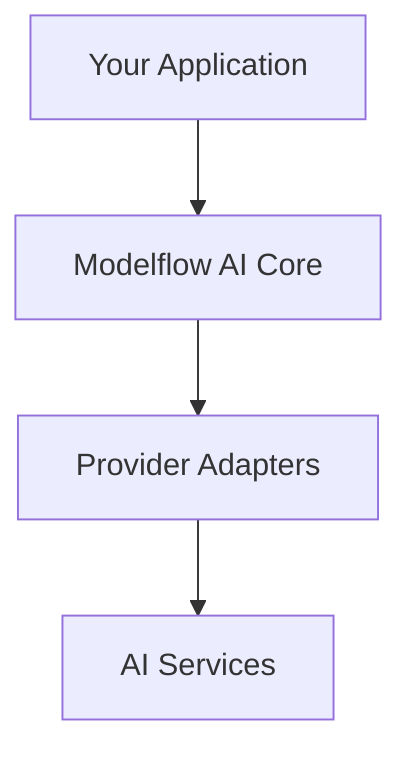

# Architecture

> **Placeholder Content** - This should explain how Modelflow AI is designed.

## What Should Be Here

This page should explain the architectural concepts that users need to understand:

### 1. Core Design Principles
- **Provider Agnostic** - Same interface for all AI providers
- **Modular** - Install only what you need
- **Type Safe** - Full PHP type safety
- **Extensible** - Easy to add new providers and features

### 2. System Architecture Diagram

### 3. Key Components
- **Request Handlers** - Main entry points (Chat, Completion, etc.)
- **Adapters** - Provider-specific implementations
- **Decision Tree** - Automatic provider selection
- **Middleware** - Request/response processing pipeline

### 4. Data Flow
- How requests flow through the system
- How responses are processed
- Role of middleware and adapters

### 5. Extension Points
- Custom adapters
- Custom middleware
- Custom tools and functions

## Content Guidelines

- Visual diagrams to explain concepts
- Clear explanation of each component's role
- Examples of how pieces fit together
- Links to relevant implementation guides