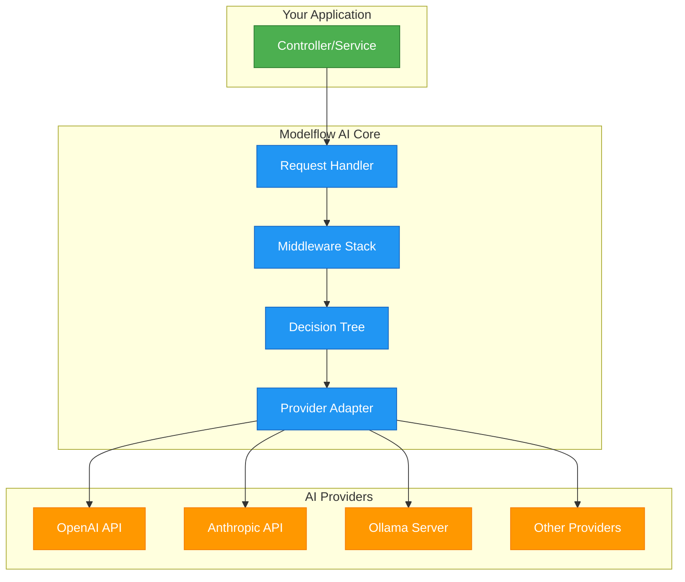

# Architecture

Modelflow AI is built on a clean, modular architecture that provides flexibility, extensibility, and maintainability. This guide explains how the system works under the hood.

## Core Design Principles

### 🎯 Provider Agnostic
All AI providers (OpenAI, Anthropic, Ollama, etc.) implement the same interfaces, allowing you to switch between them without changing your application code.

### 🧩 Modular Design
Install only the packages you need. Core functionality is separated from provider implementations and optional features.

### 🔒 Type Safe
Full PHP type safety with interfaces, generics, and strict typing throughout the codebase.

### 📈 Extensible
Plugin architecture allows custom adapters, middleware, tools, and decision criteria without modifying core code.

### 🧪 Testable
Dependency injection and interface-based design enable comprehensive unit testing and mocking.

## System Architecture



## Core Components

### Request Handlers
**Entry points for each AI capability**

- `AIChatRequestHandlerInterface` - Conversational AI with context
- `AICompletionRequestHandlerInterface` - Text completion without context
- `EmbeddingsRequestHandlerInterface` - Vector embeddings and similarity search
- `AIImageRequestHandlerInterface` - Image generation from text

Each handler provides a fluent API for building requests and supports both blocking and streaming responses.

```php
// Request handlers provide a consistent interface
$response = $chatHandler->createRequest()
    ->addSystemMessage('You are a helpful assistant')
    ->addUserMessage('Hello!')
    ->execute();
```

### Adapters
**Provider-specific implementations**

Adapters implement capability-specific interfaces to integrate with different AI providers:

- `AIChatAdapterInterface` - Provider chat implementations
- `AICompletionAdapterInterface` - Provider completion implementations  
- `EmbeddingAdapterInterface` - Provider embedding implementations
- `AIImageAdapterInterface` - Provider image generation implementations

```php
// Each provider has its own adapter
$openaiAdapter = new OpenaiChatAdapter($client, 'gpt-4o');
$anthropicAdapter = new AnthropicChatAdapter($client, 'claude-3-5-sonnet');
$ollamaAdapter = new OllamaChatAdapter($client, 'llama3.2');
```

### Decision Tree
**Intelligent adapter selection**

The Decision Tree automatically selects the best adapter based on configurable criteria:

```php
$decisionTree = new DecisionTree([
    new DecisionRule($openaiAdapter, [
        FeatureCriteria::TOOL_CALLING,
        CapabilityCriteria::BASIC
    ]),
    new DecisionRule($ollamaAdapter, [
        PrivacyCriteria::HIGH,
        CapabilityCriteria::BASIC
    ]),
    new DecisionRule($anthropicAdapter, [
        CapabilityCriteria::ADVANCED
    ])
]);
```

Available criteria types:
- `FeatureCriteria` - Specific features (tool calling, streaming, etc.)
- `PrivacyCriteria` - Privacy levels (local, cloud, etc.)
- `CapabilityCriteria` - Capability levels (basic, advanced, expert)
- `ProviderCriteria` - Specific providers (OpenAI, Anthropic, etc.)
- `ModelCriteria` - Specific models (GPT-4o, Claude, etc.)

### Middleware Stack
**Cross-cutting concerns and request processing**

Middleware provides an extensible pipeline for processing requests and responses:


Built-in middleware:
- **AdapterDecisionMiddleware** - Selects appropriate adapter using Decision Tree
- **AdapterExecutionMiddleware** - Executes the selected adapter
- **ToolExecutionMiddleware** - Handles automatic tool calling
- **ResponseFormatMiddleware** - Validates and formats responses

## Request Flow

Here's how a typical request flows through the system:

### 1. Request Creation
```php
$request = $chatHandler->createRequest()
    ->addUserMessage('Generate a Python function')
    ->withCriteria(FeatureCriteria::TOOL_CALLING)
    ->build();
```

### 2. Middleware Processing
The middleware stack processes the request:

1. **Tool Setup** - ToolExecutionMiddleware prepares available tools
2. **Response Format** - ResponseFormatMiddleware configures output format
3. **Adapter Selection** - AdapterDecisionMiddleware uses Decision Tree to select adapter
4. **Execution** - AdapterExecutionMiddleware calls the selected adapter

### 3. Adapter Execution
The selected adapter:
1. Transforms the request to provider-specific format
2. Calls the external AI service API
3. Transforms the response back to common format

### 4. Response Processing
The middleware stack processes the response in reverse order:
1. Tool execution (if tools were called)
2. Response validation and formatting
3. Final response returned to caller

## Package Structure

### Core Packages
- **`modelflow-ai/chat`** - Conversational AI with tools and streaming
- **`modelflow-ai/completion`** - Simple text completion
- **`modelflow-ai/embeddings`** - Vector embeddings and similarity search
- **`modelflow-ai/image`** - AI image generation
- **`modelflow-ai/decision-tree`** - Intelligent adapter selection
- **`modelflow-ai/experts`** - Basic AI agents

### Provider Adapters
- **`modelflow-ai/openai-adapter`** - OpenAI GPT adapter
- **`modelflow-ai/anthropic-adapter`** - Anthropic Claude adapter
- **`modelflow-ai/ollama-adapter`** - Local Ollama adapter
- **`modelflow-ai/fireworksai-adapter`** - Fireworks AI adapter
- **`modelflow-ai/mistral-adapter`** - Mistral AI adapter
- **`modelflow-ai/google-gemini-adapter`** - Google Gemini adapter

### Supporting Packages
- **`modelflow-ai/api-client`** - HTTP transport layer
- **`modelflow-ai/prompt-template`** - Template system for prompts
- **`modelflow-ai/tools`** - Built-in tools (Google Search, web scraping)

### Integration Packages
- **`modelflow-ai/symfony-bundle`** - Symfony framework integration

## Extension Points

### Custom Adapters
Create adapters for new AI providers by implementing the capability interfaces:

```php
class CustomChatAdapter implements AIChatAdapterInterface
{
    public function handleRequest(AIChatRequest $request): AIChatResponseInterface
    {
        // Transform request to provider format
        // Call provider API
        // Transform response back to common format
    }
    
    public function supports(object $request): bool
    {
        // Define what requests this adapter supports
    }
}
```

### Custom Middleware
Add custom logic to the request/response pipeline:

```php
class LoggingMiddleware implements AIChatMiddlewareInterface
{
    public function process(
        AIChatRequest $request, 
        ?AIChatAdapterInterface $adapter, 
        callable $next
    ): AIChatResponseInterface {
        $startTime = microtime(true);
        
        $response = $next($request, $adapter);
        
        $duration = microtime(true) - $startTime;
        $this->logger->info("Request processed in {$duration}s");
        
        return $response;
    }
}
```

### Custom Decision Criteria
Define your own selection logic:

```php
class CostCriteria implements CriteriaInterface
{
    public function __construct(private string $costLevel) {}
    
    public function matches(object $adapter): bool
    {
        return match($this->costLevel) {
            'low' => $adapter instanceof OllamaChatAdapter,
            'medium' => $adapter instanceof OpenaiChatAdapter,
            'high' => $adapter instanceof AnthropicChatAdapter,
        };
    }
}
```

Or use PHP enums for more type-safe criteria:

```php
use ModelflowAi\DecisionTree\Criteria\CriteriaInterface;
use ModelflowAi\DecisionTree\Criteria\FlagCriteriaTrait;

enum ResponseSpeedCriteria: string implements CriteriaInterface
{
    use FlagCriteriaTrait;
    
    case FAST = 'fast';
    case MEDIUM = 'medium'; 
    case SLOW = 'slow';
}

// Use in Decision Tree
$decisionTree = new DecisionTree([
    new DecisionRule($gpt35Adapter, [
        ResponseSpeedCriteria::FAST,
        CapabilityCriteria::BASIC
    ]),
    new DecisionRule($gpt4Adapter, [
        ResponseSpeedCriteria::SLOW,
        CapabilityCriteria::ADVANCED
    ])
]);

// Custom criteria enums can also be used in Symfony configuration
```

```yaml
# config/packages/modelflow_ai.yaml
modelflow_ai:
    adapters:
        my_fast_model:
            enabled: true
            provider: 'openai'
            model: 'gpt-3.5-turbo'
            criteria:
                - !php/const App\AI\Criteria\ResponseSpeedCriteria::FAST
                - !php/const ModelflowAi\DecisionTree\Criteria\CapabilityCriteria::BASIC
```

### Custom Tools
Add functionality that AI models can call:

```php
class WeatherTool
{
    /**
     * Get current weather for a city
     * 
     * @param string $city The city to get weather for
     * 
     * @return array{temperature: int, condition: string}
     */
    public function getCurrentWeather(string $city): array
    {
        // Fetch weather data
        return ['temperature' => 22, 'condition' => 'sunny'];
    }
}
```

### Custom Embeddings Stores
Support different vector databases:

```php
use ModelflowAi\Embeddings\Store\EmbeddingsStoreInterface;
use ModelflowAi\Embeddings\Model\EmbeddingInterface;

class CustomEmbeddingsStore implements EmbeddingsStoreInterface
{
    public function addDocument(EmbeddingInterface $embedding): void
    {
        // Store single embedding in your database
    }
    
    public function addDocuments(array $embeddings): void
    {
        // Store multiple embeddings in your database
    }
    
    public function similaritySearch(
        array $vector, 
        int $k = 4, 
        array $additionalArguments = []
    ): array {
        // Perform similarity search
        // Return array of EmbeddingInterface objects
    }
}
```

## Integration Architecture

### Symfony Bundle Integration
The Symfony bundle provides:
- Automatic service registration
- Configuration-based adapter setup  
- Criteria-based routing
- Tagged services for discovery
- Pre-configured adapters for popular models

```yaml
# config/packages/modelflow_ai.yaml
modelflow_ai:
    providers:
        openai:
            enabled: true
            credentials:
                api_key: '%env(OPENAI_API_KEY)%'
            criteria: []  # Optional custom criteria
            
        ollama:
            enabled: true
            url: '%env(OLLAMA_URL)%/'
            criteria:
                - !php/const ModelflowAi\DecisionTree\Criteria\PrivacyCriteria::HIGH
                
        google_gemini:
            enabled: true
            credentials:
                api_key: '%env(GOOGLE_GEMINI_API_KEY)%'
            criteria:
                - !php/const ModelflowAi\DecisionTree\Criteria\PrivacyCriteria::LOW
    
    adapters:
        # Pre-configured adapters are available (llama3_2, gpt4o, claude_3_5_sonnet, etc.)
        # They come with default settings that can be overridden
        
        llama3_2:
            enabled: true
            # These are set by default but can be overridden:
            # model: llama3.2
            # provider: ollama
            # chat: true
            # completion: true
            # stream: true
            
        gemini_2_0_flash:
            enabled: true
            priority: 10  # Higher priority = preferred
            # Default criteria are applied automatically:
            # - ModelCriteria::GEMINI_2_0_FLASH
            # - ProviderCriteria::GOOGLE_GEMINI
            # - CapabilityCriteria::SMART
                
        # Or define custom adapters
        my_custom_model:
            enabled: true
            provider: 'openai'
            model: 'gpt-4-turbo'
            chat: true
            completion: false
            stream: true
            tools: true
            image_to_text: false
            text_to_image: false
            criteria:
                - !php/const ModelflowAi\DecisionTree\Criteria\FeatureCriteria::TOOLS
                - !php/const ModelflowAi\DecisionTree\Criteria\CapabilityCriteria::ADVANCED
            priority: 5
            
    embeddings:
        generators:
            default:
                enabled: true
                provider: 'openai'
                model: 'text-embedding-ada-002'
                splitter:
                    max_length: 1000
                    
        stores:
            default:
                enabled: true
                dsn: 'qdrant://localhost:6333/documents'
                
    experts:
        product_analyst:
            name: 'Product Analyst'
            description: 'Analyzes product data'
            instructions: 'You are a product data analyst...'
            criteria:
                - !php/const ModelflowAi\DecisionTree\Criteria\CapabilityCriteria::ADVANCED
```

### Dependency Injection
All components are designed for dependency injection:

```php
class MyService
{
    public function __construct(
        private AIChatRequestHandlerInterface $chatHandler,
        private EmbeddingsRequestHandlerInterface $embeddingsHandler
    ) {}
}
```

This architecture provides a solid foundation for building AI-powered applications while maintaining flexibility for future requirements and provider changes.
